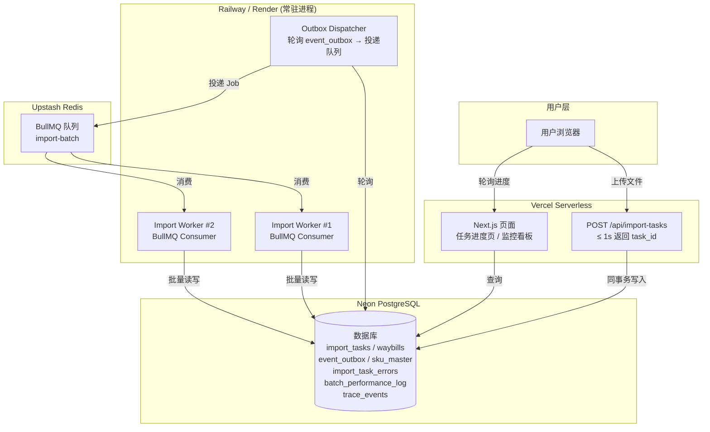

## 产品概述

将现有 V2「万能导入解析系统」的同步阻塞式下单链路重构为异步事件驱动架构。通过引入 BullMQ + Upstash Redis 消息队列、Transactional Outbox 模式、批量处理策略和全链路可观测性体系，使系统具备支撑 10,000 单/分钟的高并发导入能力，同时实现故障 1 分钟内精确定位。

## 核心功能

### 模块一：压测数据自动准备（强制）

提供 `scripts/seed-data.ts` 脚本，一键生成 20,000 条 SKU 主数据到 `sku_master` 表（格式 SKU_00001~SKU_20000），并生成 10,000 行运单 Excel 压测文件（`test-data/10000-orders.xlsx`），压测文件中故意插入少量非法 SKU 用于验证错误定位能力。脚本支持可重复执行和幂等清理。

### 模块二：上传即返回 + 创建异步任务

新建 `POST /api/import-tasks` 上传接口，接收文件和解析规则 ID，在 1 秒内完成：生成 task_id 和 trace_id、保存文件引用、预扫描总行数、创建 import_tasks 记录、按处理单元创建 Outbox 事件、返回 task_id。前端拿到 task_id 后跳转任务进度页轮询状态，按钮防重复点击。

### 模块三：Outbox 投递与队列入队

实现 Transactional Outbox 模式：任务创建与 Outbox 事件写入在同一数据库事务中完成。Outbox Dispatcher 轮询 `event_outbox` 表，将待投递事件推送到 BullMQ 队列。投递状态记录（pending/sent/failed），支持重试和 retry_count。服务宕机恢复后 Dispatcher 必须继续投递未处理事件。

### 模块四：Worker 异步处理

Import Worker 消费单个处理单元 Job，完成：读取数据块 → 复用 V2 规则引擎解析 → 批量收集 SKU 后一次性查询 `sku_master` 校验 → 执行必填/格式/重复等校验 → 成功行批量 UPSERT 到 waybills → 失败行写入 import_task_errors → 写入 batch_performance_log → 原子更新 import_tasks 进度。所有批次完成后更新任务状态为 completed/partial_success/failed。

### 模块五：处理单元幂等与重复处理保护

同一 task_id + unit_id 重复消费不重复写入运单，批量 UPSERT 基于稳定业务键（external_order_no + sku_code + line_no）。Job 重试不重复累计 processed_rows，已完成处理单元再次消费时快速返回已完成结果。

### 模块六：精细化错误记录

`import_task_errors` 表记录行级错误：task_id、batch_index、row_number、field_name、raw_value（敏感字段脱敏）、error_code（E001~E008）、error_reason、trace_id。前端支持按批次筛选、按错误类型筛选、分页加载，点击错误行展示原始值、错误原因和建议修复方式。

### 模块七：任务进度与结果页

任务详情页展示：文件名、task_id、trace_id、状态、总行数、已处理行数、成功行数、失败行数、总批次数、已完成批次数、当前吞吐量、预计剩余时间、最近错误摘要、降级标识。前端每 1~2 秒轮询 `GET /api/import-tasks/:taskId`，支持导出失败明细。

### 模块八：监控看板

监控看板页面包含 4 个核心区域：实时吞吐量（折线图，过去 5 分钟每分钟成功入库行数）、队列积压深度（等待处理批次数，超阈值橙色预警）、阶段耗时分布（解析/规则/校验/写入的 P50/P95/P99）、错误类型分布（饼图展示各错误码占比，可点击跳转错误明细）。加分项：慢批次 TOP 10、失败任务趋势、告警提示。

### 模块九：全链路 Trace 检索

支持按 task_id、trace_id、文件名、批次号、行号范围、错误码搜索。搜索结果以时间线展示（上传 → Outbox 创建 → 入队 → Worker 开始 → 校验 → 写入 → 完成），点击失败节点展示批次号、行号、字段名、脱敏原始值、错误码、错误原因、所属规则、阶段耗时、重试信息。

### 模块十：容灾降级

SKU 主数据查询超时超过 3 秒或数据库连接失败时，系统进入降级模式：跳过 SKU 校验仅做本地格式校验。任务详情页明确标注降级提示，降级状态写入任务记录和监控日志。服务恢复后新任务自动恢复正常校验。

### 模块十一：《重构假设说明》文档（强制）

提交文档包含 12 项内容：异步事件驱动选型理由、处理单元大小设计、Worker 容量规划、10,000 单/分钟性能推导、数据库连接池和并发控制、Outbox 防丢失机制、处理单元幂等设计、部分行失败处理策略、SKU 校验降级触发条件、敏感数据脱敏策略、压测数据生成清理策略、向产品/运维团队的提问清单。

## 技术栈选择

### 现有技术栈（复用）

- **框架**：Next.js 16 (App Router) + React 19 + TypeScript
- **ORM**：Drizzle ORM + `@neondatabase/serverless` (Neon PostgreSQL)
- **样式**：Tailwind CSS v4 + class-variance-authority + clsx + tailwind-merge
- **状态管理**：Zustand v5
- **虚拟列表**：@tanstack/react-virtual
- **文件处理**：xlsx、mammoth、pdfjs-dist
- **规则引擎**：完整复用 `src/lib/engine/` 现有管道式处理链路

### 新增技术栈

- **消息队列**：BullMQ + Upstash Redis（支持重试、状态追踪、失败记录；通过 `@upstash/redis` 和 `bullmq` 包接入；Worker 需部署在 Railway/Render/Fly.io 等支持常驻进程的平台）
- **测试框架**：Vitest（单元测试 + 集成测试）
- **压测工具**：k6（提供压测脚本和报告）
- **图表**：Recharts（监控看板可视化，轻量级 React 图表库）
- **UUID**：crypto.randomUUID()（Node.js 内置，无需额外依赖）
- **文件存储**：将上传文件保存到 public/ 或 Vercel Blob（短期引用）

## 实现方法

### 核心架构策略

采用 **异步事件驱动 + Transactional Outbox + 批处理** 三大模式：

1. **上传即返回**：上传 API 仅创建 import_tasks 记录和 Outbox 事件（同一事务），然后立即返回 task_id，P95 ≤ 1 秒
2. **Outbox 投递**：独立的 Dispatcher 轮询 event_outbox 表，将事件投递到 BullMQ 队列，保证任务创建与消息投递的原子性
3. **Worker 批处理**：Worker 消费单个处理单元 Job，批量解析、批量校验（一次 IN 查询）、批量 UPSERT，每个处理单元独立可重试

### 处理单元设计

- 处理单元大小：**1000 行/批**（平衡重试成本与并发效率）
- 并发模型：**2 个并发 Worker**，每个 Worker 同时处理 1 个 Job
- 10,000 行 = 10 个批次 × 1000 行，2 个 Worker 并发消费
- 写入策略：Drizzle ORM `insert().values().onConflictDoUpdate()` 实现批量 UPSERT
- 校验策略：收集批次内所有 SKU，执行 `SELECT * FROM sku_master WHERE sku_code IN (...)` 批量查询

### 数据流

```
用户上传文件 → POST /api/import-tasks
  → 开启事务
    → INSERT import_tasks (task_id, trace_id, total_rows, status='PENDING')
    → INSERT event_outbox × N (N = ceil(total_rows / 1000))
  → 提交事务
  → 返回 { task_id, trace_id, status, total_rows, total_batches }

Outbox Dispatcher (定时轮询)
  → SELECT * FROM event_outbox WHERE status='pending'
  → queue.add('import-batch', { task_id, unit_id, start_row, end_row })
  → UPDATE event_outbox SET status='sent'

Import Worker (BullMQ Consumer)
  → 读取文件对应行范围
  → 复用 V2 规则引擎解析
  → 收集 SKU → 批量查询 sku_master
  → 逐行校验 + 错误记录
  → 批量 UPSERT waybills
  → 写入 batch_performance_log
  → 原子更新 import_tasks 进度

前端轮询 GET /api/import-tasks/:taskId
  → 展示实时进度、吞吐量、错误摘要
```

### 性能评估

- 上传接口：仅写 1 条 task + 10 条 outbox 记录，预估 ≤ 200ms
- 文件解析：xlsx 库读取 1000 行约 100ms
- 规则引擎：字段映射 1000 行约 50ms
- SKU 批量校验：1 次 IN 查询约 30ms
- 批量 UPSERT：1000 行约 200ms
- 单批次总计：约 400ms，2 Worker 并发 10 批次约 2 秒总耗时
- 10,000 行全链路预估 ≤ 5 秒（远低于 60 秒目标）

## 架构设计

### 系统架构



### 新增数据表

| 表名 | 用途 | 核心字段 |
| --- | --- | --- |
| sku_master | SKU 主数据 | id, sku_code (unique), name, spec, unit |
| import_tasks | 导入任务主表 | id, file_name, status, total_rows, processed_rows, success_rows, failed_rows, total_batches, trace_id, degraded |
| import_task_batches | 处理单元状态 | id, task_id, unit_id, batch_index, start_row, end_row, status, retry_count |
| import_task_errors | 行级错误明细 | id, task_id, batch_index, row_number, field_name, raw_value, error_code, error_reason, trace_id |
| event_outbox | 本地可靠事件表 | id, aggregate_id, event_type, payload, status, retry_count, next_retry_at |
| batch_performance_log | 处理单元性能日志 | id, task_id, unit_id, parse_duration_ms, rule_duration_ms, validate_duration_ms, insert_duration_ms, total_duration_ms |
| trace_events | 链路时间线事件 | id, trace_id, task_id, unit_id, event_name, event_status, message, occurred_at |


### 目录结构

```
src/
├── app/
│   ├── api/
│   │   ├── import-tasks/
│   │   │   ├── route.ts                    # [NEW] POST 创建导入任务 + Outbox
│   │   │   └── [taskId]/
│   │   │       ├── route.ts                # [NEW] GET 查询任务进度
│   │   │       ├── errors/
│   │   │       │   └── route.ts            # [NEW] GET 查询错误明细（分页+筛选）
│   │   │       └── batches/
│   │   │           └── route.ts            # [NEW] GET 查询批次性能
│   │   ├── import-monitor/
│   │   │   └── summary/
│   │   │       └── route.ts                # [NEW] GET 监控聚合指标
│   │   └── traces/
│   │       └── [traceId]/
│   │           └── route.ts                # [NEW] GET Trace 时间线
│   ├── import/
│   │   ├── page.tsx                        # [MODIFY] 上传后跳转任务页
│   │   └── [taskId]/
│   │       └── page.tsx                    # [NEW] 任务进度与结果页
│   ├── monitor/
│   │   └── page.tsx                        # [NEW] 监控看板页面
│   └── traces/
│       └── page.tsx                        # [NEW] Trace 检索页面
├── lib/
│   ├── db/
│   │   ├── schema.ts                       # [MODIFY] 新增 7 张表的 Drizzle Schema
│   │   └── index.ts                        # [MODIFY] 保持不变（已支持 Proxy 懒加载）
│   ├── queue/
│   │   ├── client.ts                       # [NEW] BullMQ 队列连接和 Job 定义
│   │   ├── dispatcher.ts                   # [NEW] Outbox Dispatcher 轮询投递逻辑
│   │   └── worker.ts                       # [NEW] Import Worker 消费处理逻辑
│   ├── services/
│   │   ├── import-task.service.ts          # [NEW] 导入任务服务层（创建任务、查询、状态更新）
│   │   ├── batch-processor.service.ts      # [NEW] 批处理服务（解析、校验、写入的编排）
│   │   └── sku-validator.service.ts        # [NEW] SKU 批量校验服务（含降级逻辑）
│   ├── utils/
│   │   ├── trace.ts                        # [NEW] traceId 生成和链路事件记录工具
│   │   └── mask.ts                         # [NEW] 敏感数据脱敏工具（手机号、地址）
│   └── engine/
│       └── index.ts                        # [MODIFY] 新增 readFileFromBuffer 按行范围解析的导出
├── types/
│   ├── import-task.ts                      # [NEW] 导入任务相关类型定义
│   └── monitor.ts                          # [NEW] 监控指标类型定义
├── components/
│   ├── import/
│   │   ├── TaskProgressPanel.tsx           # [NEW] 任务进度面板（进度条+状态+吞吐量）
│   │   └── ErrorDetailPanel.tsx            # [NEW] 错误明细面板（筛选+分页+详情弹窗）
│   └── monitor/
│       ├── ThroughputChart.tsx             # [NEW] 实时吞吐量折线图
│       ├── QueueDepthGauge.tsx             # [NEW] 队列积压深度指示器
│       ├── StageLatencyChart.tsx           # [NEW] 阶段耗时分布柱状图
│       └── ErrorDistributionChart.tsx      # [NEW] 错误类型分布饼图
├── stores/
│   └── import-store.ts                     # [MODIFY] 扩展异步任务状态字段
└── middleware.ts                           # [MODIFY] 可选：添加 API 限流保护

scripts/
├── seed-data.ts                            # [NEW] 压测数据生成脚本（SKU + Excel）
└── load-test.js                            # [NEW] k6 压测脚本

test-data/
└── 10000-orders.xlsx                       # [NEW] 生成的 10,000 行压测文件

docs/
└── REFACTOR_ASSUMPTIONS.md                 # [NEW] 重构假设说明文档
```

## 实施说明

### 性能关键点

- **批量校验**：收集批次内所有 SKU 后使用 `WHERE sku_code IN (...)` 一次性查询，避免 N+1 问题。查询结果缓存到 Map 中供逐行校验使用
- **批量写入**：使用 Drizzle `insert(waybills).values([...]).onConflictDoUpdate()` 实现批量 UPSERT，每批 1000 行一次 SQL 操作
- **原子进度更新**：使用 `UPDATE import_tasks SET processed_rows = processed_rows + 1000 WHERE id = $1` 原子增减，避免并发 Worker 互相覆盖
- **轮询优化**：前端轮询间隔 2 秒，API 仅返回必要字段，避免返回全量数据

### 日志规范

- 复用现有 `console.log` 模式，增加结构化前缀：`[task_id] [unit_id] [阶段] 消息`
- traceId 注入到每条日志中，便于 Trace 检索串联
- 敏感字段（手机号、地址）在日志中使用脱敏工具处理后再输出

### 向后兼容

- 现有 `/api/waybills/submit` 路由保留，但标记为 deprecated
- 现有 waybills 表不变，仅新增 `external_order_no` 字段和索引用于幂等去重
- 现有前端页面结构不变，导入页增加异步任务模式切换入口
- 现有规则引擎完整复用，仅新增按行范围解析的 buffer 入口

### 新增依赖

```
{
  "dependencies": {
    "bullmq": "^5.x",
    "ioredis": "^5.x",
    "recharts": "^2.x"
  },
  "devDependencies": {
    "vitest": "^2.x",
    "@vitest/coverage-v8": "^2.x"
  }
}
```

## 设计风格

采用专业的企业级数据监控风格，延续现有 V2 系统的浅色主题和组件风格。任务进度页和监控看板以信息密度优先，使用卡片式布局组织数据。核心配色延续现有系统的蓝色主色调，辅以绿色（成功）、橙色（警告）、红色（错误）功能色。

## 页面规划

### 页面一：任务进度页（/import/[taskId]）

- **顶部状态栏**：任务文件名、task_id、trace_id 复制按钮、状态标签（PENDING/processing/completed/partial_success/failed 对应不同颜色）
- **进度概览卡片**：环形进度条展示完成百分比，下方四列统计（总行数/已处理/成功/失败），当前吞吐量（行/秒）和预计剩余时间
- **批次状态列表**：每个批次的处理状态、行范围、耗时、重试次数，支持展开查看详情
- **错误摘要区域**：按错误类型聚合展示（E001 SKU不存在: 5条、E003 电话格式错误: 3条），点击跳转错误明细
- **降级警告横幅**（条件展示）：黄色背景，明确提示「SKU 校验已降级」
- **操作按钮**：导出失败明细 Excel、返回导入页

### 页面二：监控看板（/monitor）

- **实时吞吐量卡片**：Recharts 折线图，X 轴为时间（过去 5 分钟），Y 轴为每分钟成功入库行数，支持自动刷新
- **队列积压深度卡片**：数字指示器展示当前等待处理批次数，超过 5000 行阈值数字变橙色，队列不可用变红色
- **阶段耗时分布卡片**：Recharts 柱状图，4 组柱子（解析/规则/校验/写入），每组展示 P50/P95/P99 三个指标
- **错误类型分布卡片**：Recharts 饼图，各错误码占比，图例可点击跳转到对应错误筛选页
- **慢批次 TOP 10 表格**（加分项）：展示最慢的 10 个批次，含 task_id、批次号、总耗时、阶段耗时明细

### 页面三：Trace 检索页（/traces）

- **搜索区域**：多条件搜索表单（task_id/trace_id/文件名/批次号/行号范围/错误码），提交按钮
- **时间线展示**：垂直时间线组件，每个节点展示事件名称、状态、时间戳、消息，失败节点标红
- **失败节点详情弹窗**：点击失败节点展开详情面板，展示批次号、行号、字段名、脱敏原始值、错误码、错误原因、所属规则、阶段耗时、重试次数、修复建议

### 页面四：导入页改造（/import）

- 保留现有上传区域和规则选择流程
- 新增异步导入模式开关（默认开启）
- 开始导入后显示上传进度条，完成后跳转到 `/import/[taskId]` 任务进度页

## 推荐的智能体扩展

### Skill

- **xlsx**
- 用途：生成 10,000 行压测 Excel 文件（`test-data/10000-orders.xlsx`），从 SKU 主数据中随机抽取 SKU 并故意插入少量非法 SKU
- 预期成果：可重复使用的 10,000 行压测 Excel 文件，包含合法和非法数据混合

### SubAgent

- **code-explorer**
- 用途：在实现过程中探索现有代码库的具体实现细节，确保新代码与现有架构一致
- 预期成果：获取现有组件模式、API 路由写法、Drizzle 查询模式等参考实现